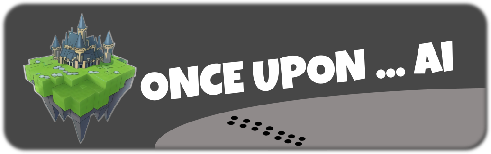
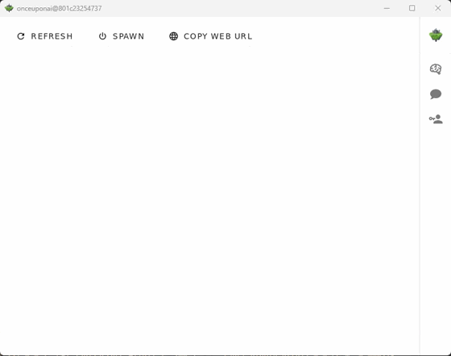

# Once Upon ... AI: Start Your AI Adventures with Ease

## Introduction

Once Upon ... AI is a rust-based desktop/server application designed to simplify the setup and usage of machine learning models (LLMs, Embedding models, Image generative models, Vision models and other). 
Whether you want to quickly test different models like LLM-s with different parameters or build scalable solution this app streamlines the entire process.
With support for both CPU and CUDA-accelerated GPU environments, you can deploy models locally or scale them across multiple nodes for production environments. 

    

## Supported Models

<!--
## Quick Start

Installation
Platform Support:

Linux
Windows
macOS (Coming Soon)

General Installation Steps:

Download the App:
Grab the latest release from the GitHub Releases page. Download the appropriate binary for your platform.

Run the Application:

Linux:
Download the binary and give it execute permissions:
bash
Copy code
chmod +x once_upon_ai
./once_upon_ai
For CUDA support, ensure CUDA libraries are installed. Refer to the CUDA installation guide.
Windows:
Simply double-click the downloaded executable.
Important: The application is not yet signed with a trusted certificate, so Windows Defender might show a warning. Click "More info" and then "Run anyway" to start the application.
macOS:
Coming soon!
Install CUDA (Linux Only):
To utilize GPU acceleration on Linux, install the required CUDA libraries. Follow the official CUDA installation guide or use your package manager:

bash
Copy code
sudo apt-get install nvidia-cuda-toolkit
Launching the App:
Run the application as a desktop app or in headless mode for production deployments.

API Usage Example:

python
Copy code
import requests

# Example API call to interact with a deployed LLM model
response = requests.post(
    "http://localhost:8000/api/v1/generate",
    json={"prompt": "Once upon a time...", "model": "gemma"}
)
print(response.json())
Or use curl:

bash
Copy code
curl -X POST http://localhost:8000/api/v1/generate -H "Authorization: Bearer <TOKEN>" -d '{"prompt": "Once upon a time...", "model": "gemma"}'
Supported Models
"Once Upon ... AI" currently supports the following models:

Embedding Models:
E5
Large Language Models:
Gemma
Llama
Phi
Mistral
Vision Models:
(Add the list of supported Vision models here)
Each model comes pre-configured with appropriate parameters, making it easy to get started without diving into the complexities of setup.

Architecture
Once Upon ... AI is built using an advanced actors architecture, leveraging Rust's high-performance capabilities. The application uses the Actix Telepathy framework to implement a distributed system of actors, allowing each model to run as an isolated actor (process). This design offers several advantages:

Scalability: Deploy models across multiple nodes or machines, ensuring high availability and performance in production environments.
Modularity: Easily spawn or terminate model deployments via the desktop app, giving you full control over your resources.
Gateway/Seed Node: The central gateway node exposes a REST API, allowing for seamless integration with external services and client applications.
This architecture is not only ideal for local testing but is also robust enough to handle large-scale production workloads.

Authentication
Security is a top priority in "Once Upon ... AI". Both the REST API and the Actix server UI are secured using Personal User Tokens. Additionally, the web server supports integration with OIDC providers for streamlined authentication in enterprise environments.

Personal User Tokens: Each user must generate a unique token to access the API. This token ensures that only authorized users can interact with the deployed models.
OIDC Integration: For environments requiring enterprise-level security, the Actix server UI can integrate with popular OpenID Connect providers, offering a seamless and secure authentication experience.
Conclusion
Once Upon ... AI is a cutting-edge tool designed to make machine learning more accessible and scalable. Whether you're a developer experimenting on your local machine or deploying complex models in a production environment, this app provides the performance, security, and flexibility you need. Dive into your AI adventures today, and let "Once Upon ... AI" simplify the story of your next project.

sudo /home/ubuntu/rust-src/onceuponai/scripts/postinstall.sh

-->